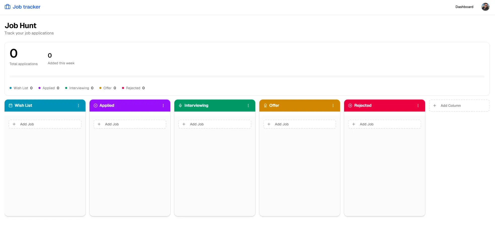
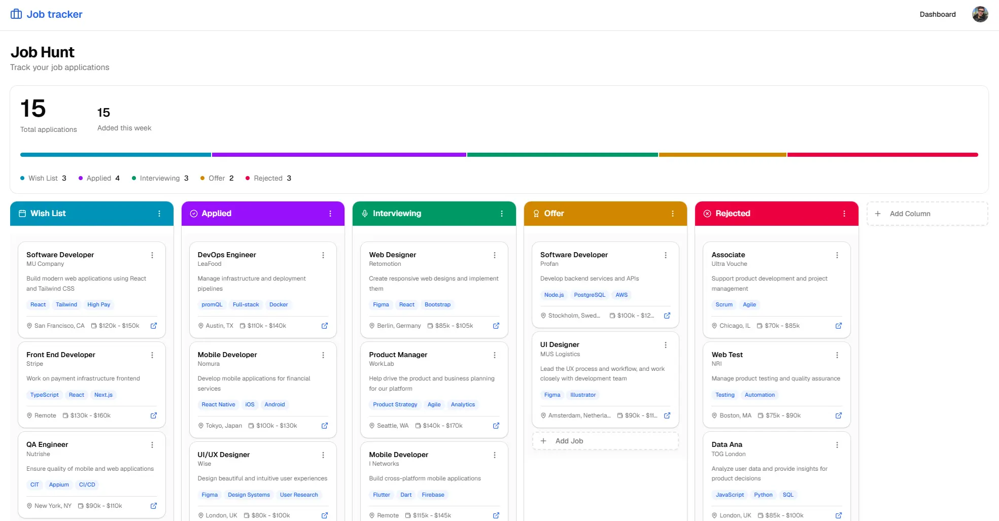
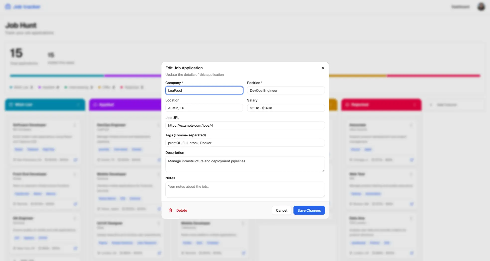

<div align="center">

# 💼 Job Tracker

**A Kanban board for a job search, because a spreadsheet forgets which of the eleven roles already replied.**

[](https://nextjs.org)
[](https://react.dev)
[](https://www.typescriptlang.org)
[](https://tailwindcss.com)
[](https://www.mongodb.com)



</div>

---

## 🎯 The idea

Job hunting is a pipeline, and pipelines want a board rather than a list. Every role is a card that moves from wish list to applied to interviewing, and the shape of the board tells you at a glance whether you are applying enough or waiting too long.

Built as a full-stack exercise in Next.js 16: Server Actions as the only write path, optimistic client state that can undo itself, and drag and drop that behaves the way people expect it to.

## ✨ Features

|                             |                                                                                   |
| --------------------------- | --------------------------------------------------------------------------------- |
| 🖱️ **Drag and drop**        | Cards open a gap where they will land, across columns as well as within one       |
| 🧩 **Columns you define**   | Rename the defaults, add a take-home stage, delete what you do not use            |
| 📊 **Pipeline at a glance** | Totals per stage as a distribution bar, plus what you added this week             |
| 🏷️ **Tags, notes, salary**  | The recruiter's name, the brief and the number sit with the application           |
| 🔐 **Email or Google**      | Password sign-in with verification, or one click with Google, on the same account |
| 🌗 **Light and dark**       | Follows the system by default, switchable from the avatar menu                    |

<div align="center">


</div>

---

## 🧠 Decisions worth reading

Most of the interesting work is not in the feature list.

**Cross-column drag needed a preview, not just a drop handler.** Each column owns its own `SortableContext`, and dnd-kit only shifts items inside the context holding the dragged card, so the target column never opened a gap. Moving the card between columns from `onDragOver` puts it into the right context mid-gesture, which in turn meant `handleDragEnd` had to read the final position from current state rather than from where the drag began.

**Optimistic state that can undo itself.** The board applies a move locally and then persists it. Server actions report refusals as a return value rather than by throwing, so the hook checks the result, restores a pre-drag snapshot when it fails, and raises a toast, instead of leaving the card somewhere the database does not agree with.

**Ownership is re-checked on every write.** A job belonging to the caller says nothing about the column it is being moved into. Without that second check, a crafted request could push a card onto someone else's board.

**The colour palette is validated, not chosen by eye.** The original column colours put `yellow-500` and `green-500` at a ΔE of 4.2 under protanopia, effectively the same colour for some readers. That was survivable while they sat in separate columns, but not once they became adjacent segments of one distribution bar, so the palette was re-stepped until every adjacent pair cleared ΔE 8.

**The environment is the feature flag.** `lib/env.ts` parses `process.env` through Zod at import time and derives `isEmailEnabled` and `isGoogleAuthEnabled` from it. Missing credentials switch a feature off cleanly rather than failing at the first call, and a misconfigured deployment fails at startup with every problem listed at once.

---

## 🧱 Stack

| Layer          | Choice                                                                |
| -------------- | --------------------------------------------------------------------- |
| **Framework**  | Next.js 16 (App Router, Cache Components, Server Actions) · React 19  |
| **Language**   | TypeScript, strict                                                    |
| **Styling**    | Tailwind CSS v4 · Base UI primitives · `lucide-react` · `next-themes` |
| **Drag layer** | `@dnd-kit` core + sortable                                            |
| **Data**       | MongoDB with Mongoose                                                 |
| **Auth**       | Better Auth — email/password, Google OAuth, sessions, rate limiting   |
| **Validation** | Zod, on every server action and on the environment itself             |
| **Email**      | Nodemailer over SMTP                                                  |

```
app/                    routes: landing, auth, dashboard, settings
components/             board, cards, dialogs, ui primitives
lib/
  actions/              server actions, the only place that writes
  validation/           zod schemas shared by the actions
  models/               mongoose schemas and client-facing types
  hooks/useBoards.ts    optimistic board state with rollback
  auth/                 Better Auth server and client
  email.ts              SMTP transport and templates
  env.ts                environment schema and feature flags
```

---

## 🔒 Security

- Session and ownership are re-checked inside every server action, never assumed from the client.
- Input passes through Zod before reaching Mongoose, including object-id shape and length caps.
- `jobUrl` is restricted to `http(s)`, so a stored `javascript:` URL cannot execute from a card link.
- CSP, HSTS, `X-Frame-Options`, `nosniff`, Referrer-Policy and Permissions-Policy ship on every route.
- Auth is rate limited: five sign-in attempts per minute, five sign-ups per hour.
- Changing a password revokes every other session.

**Verification gates account linking.** Better Auth refuses to attach a social identity to a local account that has not verified its email, which stops someone pre-registering on a victim's address and inheriting their Google login. With SMTP configured, as it is in deployment, that guard is enforced. Without it sign-ups cannot be verified at all, so the app degrades to leaving it off rather than refusing every link.

---

## 🛠️ Running it locally

<details>
<summary>Setup</summary>

Needs Node 20+ and a MongoDB database.

```bash
git clone https://github.com/sepicn/job-application-tracker.git
cd job-application-tracker
npm install
npm run dev
```

Create `.env.local`:

```ini
MONGODB_URI=
BETTER_AUTH_SECRET=            # 32 characters or more
BETTER_AUTH_URL=http://localhost:3000
NEXT_PUBLIC_BETTER_AUTH_URL=http://localhost:3000
```

Everything below is optional. Leave a block blank and that feature stays off.

```ini
SMTP_HOST=                     # verification, password reset, email change
SMTP_PORT=465
SMTP_USER=
SMTP_PASSWORD=                 # Gmail wants an app password, not the account one
EMAIL_FROM=

GOOGLE_CLIENT_ID=              # Google sign-in
GOOGLE_CLIENT_SECRET=          # redirect: <BETTER_AUTH_URL>/api/auth/callback/google
```

Signing up creates a board with five stages. To fill one with sample data:

```bash
SEED_USER_EMAIL="you@example.com" npm run seed:jobs
```

| Command             | Does                     |
| ------------------- | ------------------------ |
| `npm run dev`       | Development server       |
| `npm run build`     | Production build         |
| `npm run lint`      | ESLint                   |
| `npm run format`    | Prettier                 |
| `npm run seed:jobs` | Seed sample applications |

</details>
